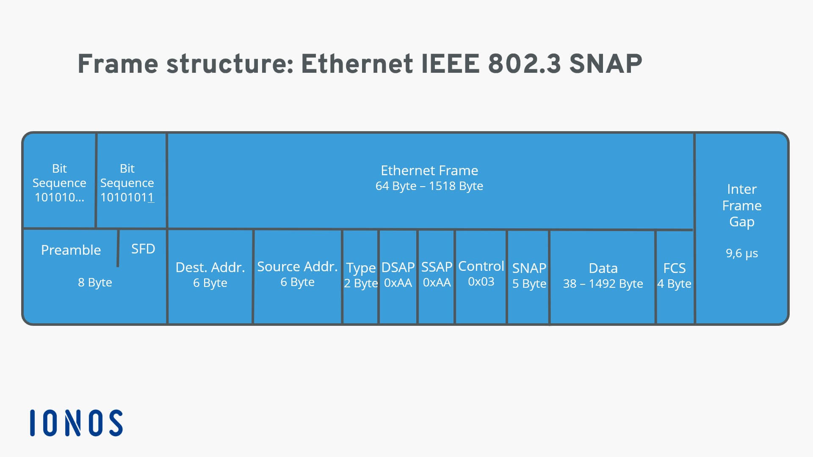
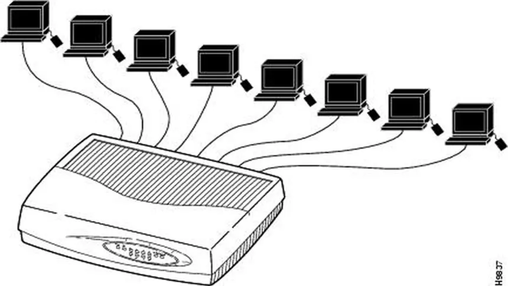
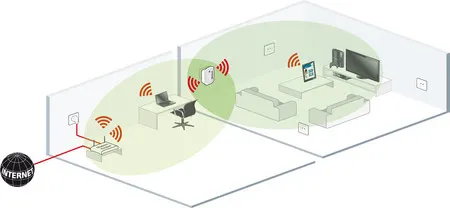

# Redes
# 4 de abril 2025 - Semana 4
# Francisco Villanueva Quirós - 2021043887

## Ethernet 
### Ethernet Clasica
- Ya no se usa
- Velocidades de 3 a 10 mbps.
- Un solo cable alrededor de un edificio, donde se conectaban las computadoras
- Ethernet gruesa: Cable coaxial de aproximadamente 1 cm de diámetro con alcance de hasta 500 metros que requería transceptores especiales (vampire taps) para las conexiones.
- Ethernet delgada: Cable coaxial más fino (0.5 cm) con alcance de hasta 185 metros que utilizaba conectores BNC en T para facilitar su instalación
- Datos codificados en Manchester
- Usa CSMA/CD con retroseso exponencial binario

### Ethernet Conmutada (802.3)
- Ethernet (10mbps), Fast Ethernet (100mbps), Gigabit Ethernet (1Gbps) y 10 Gigabit Ethernet (10gbps).  
**Autonegociación**
- Cada estación cuenta con un cable dedicado que llega al hub central.
    - un **hub** conecta todos los cables que llegan a él
    - Los hubs conectan todas las estaciones y paquetes que se entregan por **difusión**
    - Todas las estaciones están en el mismo **dominio de colisión**
- El hub fue cambiado por un **switch**:
    - El **switch** sabe que estaciones están conectadas en sus puertos
    - Solo envía paquetes a las estaciones destino
    - Cada estación es su dominio de colisión
        - Si es full duplex, no existen colisiones. Transmisiones simultáneas en ambos sentidos
        - Si es half duplex, se participa por el canal con trampas que entran al **switch** y salen del **switch**. 
    - Se puede enviar mútiples tramas.
    - Dispositivo caro
    - Mejora el rendimiento
    - Tiene buffers

#### Comparativa entre el hub y switch
Los hubs simplemente replican todas las señales recibidas hacia todos los puertos (difusión), creando un único dominio de colisión donde todos los dispositivos compiten por el mismo ancho de banda. En contraste, los switches son dispositivos inteligentes que conocen qué dispositivo está conectado a cada puerto mediante una tabla de direcciones MAC, enviando datos exclusivamente al puerto destinatario, lo que crea dominios de colisión independientes y permite múltiples comunicaciones simultáneas. Mientras los hubs trabajan en la capa física y solo permiten half-duplex, los switches operan en la capa de enlace, admiten full-duplex y ofrecen un rendimiento significativamente superior, razón por la cual han reemplazado a los hubs en las redes modernas.

### Hub
- Conecta NIC's de computadoras con el hub usnado RJ45 y cables UTP
- Tienen muchos puertos 
- Se pueden conectar uno con otro extendiendo la red
    - Cada uno debe estar separado de 100mts
- Solo una estación puede transmitir al mismo tiempo
    - Aun con multiples hubs conectados
- Se dan retrasos
- Half duplex

### Repetidores
- Regeneran señal
- Amplificación de señal
- Proporcionan extender el rango de una LAN
- Permite dar potencia a la señal para que pueda viajar mas distancia
- Puede conectar dos o mas segmentos
- Permite el desarrollo de PoE
    - Power over Ethernet

### Bridge
- Conecta y filtra el tráfico entre dos o más segmentos de red
- Funciones principales:
    - Segmentación de redes para reducir el tráfico
    - Filtrado de tramas según direcciones MAC
    - Aislamiento de dominios de colisión
- Aprende automáticamente qué dispositivos están en cada segmento mediante una tabla de direcciones MAC

### Switches
- Similar a un bridge
- Permite conectar muchisimos segmentos
- Permite realizar multiples configuraciones
    - Vrirtual LAN's
- Es inteligente para entregar las tramas a las estaciones adecuadas
    - Reduce el gasto de ancho de banda
- Seguridad: Solo ven los paquetes que se les envían, a menos que este en modo promiscuo
- Caros comparados con los hubs
- Nos existe limite de switches interconectados

### Virtual LAN
- Red de área local virtual que agrupa dispositivos lógicamente, independientemente de su ubicación física
- Permite la segmentación de una red física en múltiples redes lógicas aisladas
- Características principales:
    - Segmentación de tráfico sin necesidad de hardware adicional
    - Mayor seguridad al aislar grupos de usuarios
    - Mejor administración del ancho de banda
    - Reducción de dominios de broadcast
    - Flexibilidad en la organización de la red

