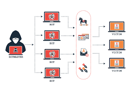
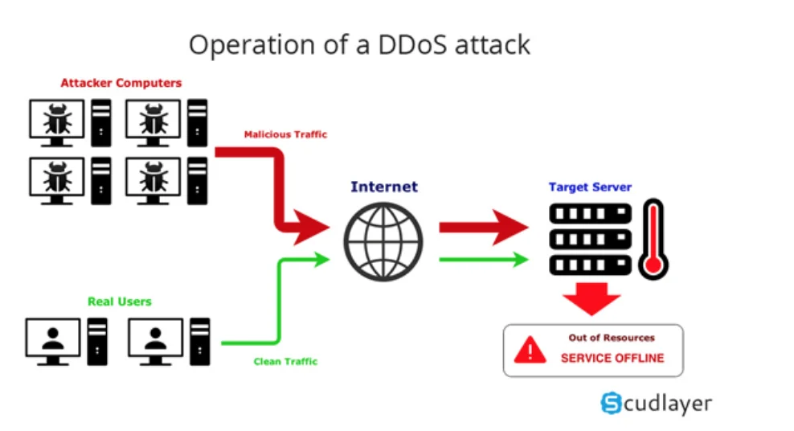
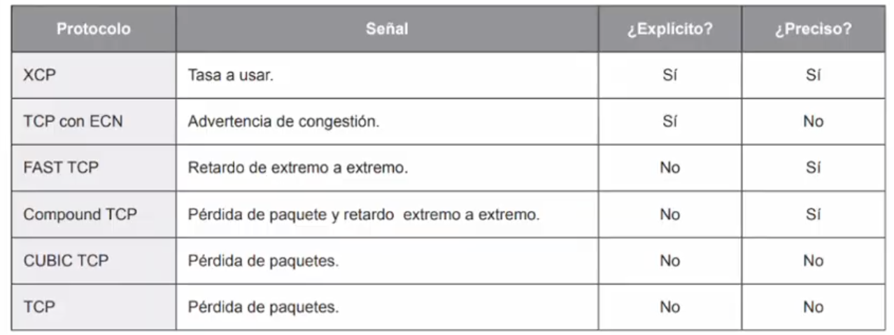

# Redes

# 23 de mayo 2025

# Francisco Villanueva Quirós - 2021043887

## Control de Congestion
- La congestión se produce en la capa de red, pero se genera debido a la capa de transporte
- Solo se puede evitar si la capa de transporte envía paquetes mas lentamente. 
- Buena asignación de ancho de banda entre entidades mas lentamente. 
	- Usa toda la capacidad
	- Asignación de ancho de banda hasta que el retardo aumenta con rapidez
	- Convergencia hacia el punto ideal de operación
	- Equidad en asignación 
- Regulación de tasa den envío 
	- Control de flujo
	- Congestión
		- Inalámbrico

## Algoritmos de control de congestión
- Control de flujo se resuelve de forma local, este viene dado que tiene una estación fuere en envio de paquetes pero mas débil en recursos computacionales. 
- Lo paquetes se guardan en lo buffers, si estos se llenan a la información hay que hacerle un drop
- Por cada conexión normalmente se genera un thread y este va a tener un consumo de file descriptors. Solo se agota la memoria disponible
- La maquinas conoce el TTL, se manda un paquete antes que se acabe y asi se mantiene la conexión
- Es 1 a 1 con las máquinas -> Local
- Taildrop: Desprender carga que le entra al buffer. Agarra información del buffer y la bota, es un drop. 

## Solución ataques DOS - Tarpit


- Con un servidor y un cliente, este intenta hacer un ataque DOS 1 a 1 (no distruibuido). El cliente hace muchos forks, con muchos procesos que abren peticiones al servidor
- El servidor tiene un método POST, hace una transformación es una que va a consumar CPU y memoria, el DoS va abrir un monton de sockets y monton de threads. 
- Este tipo de ataques busca ofuscar la memoria y el CPU. 
- Cuando un cliente valido va a enviar una petición, el servidor va a retornar un timeout, por el ataque que le estan haciendo. 
- El codigo del fork que va hacer ese ataque es un:
```
While true
var response = https://convert_image...
```
- Si el ttl de la conexión es de 5 segundos, el cliente y el servidor lo conoce, entonces se manda un bit cada segundo. Esto genera en la capa de aplicación que el cliente http no muere por que el ttl no expira. 
- El servidor bloquea el cliente manteniendo la conexión, enviando un bit cada 4 segundos. 
- TARPIT

## Concepto DDOS

Un ataque DDOS ocurre cuando muchos dispositivos envían grandes cantidades de tráfico o peticiones a un servidor o red, saturando sus recursos y provocando que deje de funcionar correctamente para usuarios legítimos.


## Congestión
- Problema global
- Internet es una colección de grafos. Los nodos sin conexiones entrantes son los llamados clientes.
- El tráfico no tiene patrón y el internet tampoco. 
- El problema es cuando un router no puede manejar la carga de información que esta pasando a través de el
- Se esta ofuscando el CPU, la memoria, buffers o la red. 
- La maquina puede pensar que esta cerca de entrar congestión y genera una notificación a los peers que no manden información a través de esta. 
- Cambio de prioridad del enlace, afecta lo pesos en las aristas. 
- La paquetería se mueve por otra ruta. 
- Se puede modificar los parámetros de notificación cuando el buffer llega a x% del uso. 
- Si se llenan los buffers antes de notificar, el router muere. No va a poder hacer el manejo que sus peers se dieron cuenta
- Cuando una maquina recibe un timeout baja el rate de transmisión, y se deja de usar el ancho de banda disponible
- Si el router es pesimista, puede generar una sobre utilización de recursos disponibles, esto cuando se congestiona antes de estar congestionado. 
- Si es muy optimista, puede ser que sea tarde y no se de cuenta que esta congestionado. 



XCP:
- Protocolo de control de congestión explícito.
- Los routers indican explícitamente la tasa de envío permitida al emisor.

TCP con ECN:
- Extensión de TCP que notifica congestión sin perder paquetes.
- Marca los paquetes en vez de descartarlos cuando hay congestión, y el receptor lo comunica al emisor.

FAST TCP:
- Variante de TCP para redes de alta velocidad.
- Ajusta la ventana de congestión usando el retardo de ida y vuelta (RTT) como señal.

Compound TCP:
- Mejora de TCP para Windows.
- Combina pérdida de paquetes y retardo RTT para calcular el tamaño de la ventana.

CUBIC TCP:
- Protocolo por defecto en Linux para redes modernas.
- Usa una función cúbica del tiempo desde la última pérdida para ajustar la ventana.

TCP:
- Protocolo clásico de control de congestión.
- Reduce la ventana cuando detecta pérdida de paquetes, asumiendo que hay congestión.