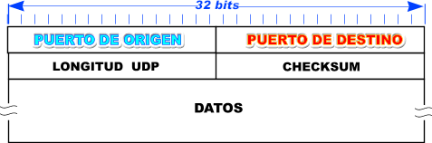
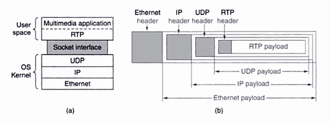
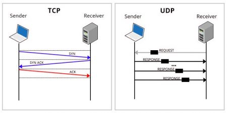

# Redes

# 27 de mayo 2025

# Francisco Villanueva Quirós - 2021043887

## Tarea 2

### Documentación
- Agregar una tabla para ver que funciono y que no funciono.
- Fecha de entrega: viernes de semana 17

## User Datagram Protocol (UDP)

- No es orientado a conexión
- Envío datagramas IP
- Lo puertos son terminales
    - Origen = enviar respuesta
    - Destino = donde debe ser entregado
- Logitud maxima
    - 65535 (IP) -> MTU
- No:
    - control de flujo
    - control de congestión
    - retransmisión
- DNS
- Remote Procedure Call
- Multemedia en tiempo real
    - RTP = Real tiem Transport Protocol
        - Espacio de usuario (OS)

Cuando se envia el paquete UDP tiene que haber un parte de codigo en capa de aplicación que tenga retries, timeouts, ack. UDP puede tranportar TCP y viceversa. 

En los VPN, se establece una conexión entre un servidor y un cliente, el puerto 443, el VPN tiene un alto alcance. Cuando se usa 443, se usa TCP y genera un problema que cuando se mandan paquetes UDP estos pasan por establecimiento de TCP y dura mucho haciendo la transmisión. Comunicación TCP igual es lenta. 

Si quiero aumentar la capacidad de mi VPN, tengo que moverme a UDP. Si dentro de un VPN un paquete se pierde, o vuelve a mandar el cliente del navegador. 

Handshake de TCP: es el proceso mediante el cual se establece una conexión TCP entre dos dispositivos. Hay SYN, SYN-ACK y ACK. Una vez completados estos tres pasos, se establece oficialmente la conexión TCP y ambas partes pueden comenzar a intercambiar datos. Este proceso garantiza que ambos extremos estén preparados para la comunicación y sincronizados antes de que comience la transferencia de datos real.

Hace tiempo, cuando uno queria hacer cluster de computadoras, se queria ejecutar operaciones atomicas brincandos la lentitud de TCP. Ej. un jump en ensamblador son operaciones atómicas, no van a tener un estado. Un **sistema de memoria compartida**, es que un objecto puede almacenar memoria en otro objeto. Se utiliza un sistema UDP que abre un puerto UDP y este recibe operaciones primitivas de la arquitectura del computador. 

**RESUMEN**
- UPD = velocidad
- TCP = fiabilidad de entrega
- Puerto = 443

## Transmission Control Protocol (TCP)
- Flujo de bytes confiable sobre un red no confiable
- Entidades de transporte TCP
    - Recibe flujos de datos
    - Divide en fragmentos de max 64KB ethernet, encabezado IP y TCP
    - Envia datos sobre la red
    - Reconstruye flujos
- Emisor y receptor crean sockets
- Well known ports (1024)
- Full duplex y punto a punto
- Push (TCP_NODELAY); buffers

- Intercambia datos en forma de segmentos
- Segmento TCP
    - Encabezado de 20 bytes
        - contiene una parte opcional
- Segmento no puede ser mayor a 65535
    - debe ser menor al MTU
        - Descubrimiento de MTU
- TCP usa ventana deslizante

## Encabezado TCP
