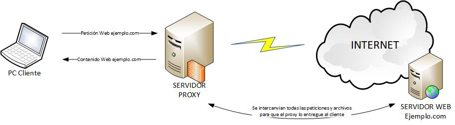
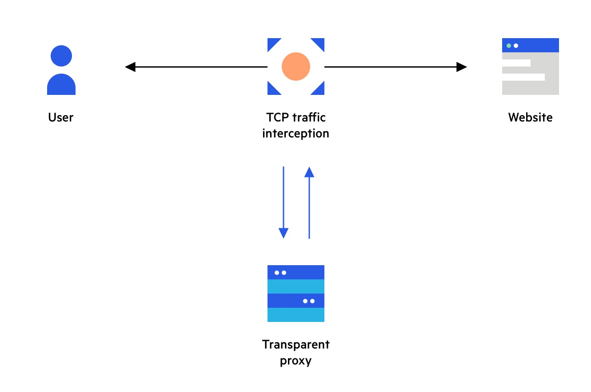
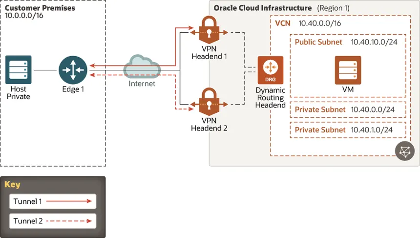
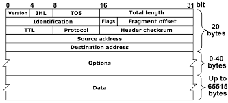
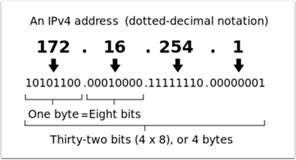

# Redes

# 6 de mayo 2025

# Francisco Villanueva Quirós - 2021043887

  

## Proxy

  

Proxy: Esta a nivel de Capa 7. Cuando el cliente se va a conectar el cliente puede tener un proxy transparente o uno especifico.

- Transparente: Servidor intermediario que intercepta automáticamente las comunicaciones de red sin configuración en los dispositivos cliente, siendo invisible para los usuarios finales.

- Especifico: Servidor intermediario explícitamente configurado en los dispositivos cliente que requiere que los usuarios proporcionen manualmente la dirección IP y puerto del proxy para establecer conexiones.

  

Desde el cliente hacia el proxy se usa la dirección de Costa Rica pero si se manda a UK se manda desde el servidor.

  

Por estandar de industria de usa HTTPS_Proxy. Se permite hacer auditorias del tráfico que sale de la red.

  
  

Existen varios estandar como:

- ISO 27001

- NIST

- PCI DSS

  

**NOTA**: El tráfico que no pasa por HTTP, no pasa por el proxy.

  

El proxy transparente, el cliente siempre tiene que usar el router para salir por internet. El cliente utiliza mecanismos de capa 3 y llega esa información llega al router y mediante capa 4 podemos ver que puertos estamos usando. Ej. 80, 443, 8080, 8081, 8082.

  

**Proxy UDP:** es un servidor intermediario que maneja y redirige tráfico basado en el protocolo UDP (User Datagram Protocol), permitiendo que aplicaciones que usan este protocolo, como servicios de streaming, juegos en línea o VoIP, puedan comunicarse a través de redes con restricciones o firewalls.

  

**NOTA**: Cualquier servicios que no se corra en 443, el servicio va a desaparecer. Esto por que todos los firewall tiene abierto el puerto 443.

  

Cuando el router descubre el trafico, lo pasa hacia el servidor de UK (ejemplo) y lo saca hacia google. La diferencia es que no nos damos cuenta que no salimos atraves de un proxy y asi se puede ver el tráfico del cliene.

  

Mobile IPv4/Mobile IPv6: Se tiene:

- **Home Network:** Cuando el cliente esta en casa de usa el ip 10.10.20.56 (ejemplo) -> Se puede abrir un telnet para comunicarse con el cliente. Se va a trabajar con un agent y este va a tener el IP, este se da de forma dinámicamente. Solo la gente de esta red puede saber donde esta el cliene. Si se envía un mensaje y el cliente no esta en casa, el agene envía el mensaje mediante el internet hacia el cliente.

- **Foreign Network:** Si el mismo cliente se mueve a este, el cliente cambia el ip 172.167.9.1 y no se puede saber la ubicación geográfica. Si el cliente se va de la red de la casa, este se conecta con el agente de la casa y se muestra que este sigue en la casa. Se abre un túnel en capa 3. Si se envía un mensaje y el cliente no esta en casa, el agene envía el mensaje mediante el internet hacia el cliente.

  

## VPN

  

Una VPN es una tecnología que permite establecer una conexión segura y cifrada entre un cliente y un servidor a través de una red pública,

  

Se va a tener un cliente, se tiene un dispotivo en la red de la casa de nosotros. En el momento que se saca trafico hacia internet, hace mediante el router e internet lo envía al servidor

  

Tabla de ruteo, se tiene una ruta por defecto con la mascara 0.0.0.0, el numero de red 0.0.0.0 y por donde saco el tráfico eth0. Siempre se da prioridad a la ruta mas específica.

  

VPN maneja capa 3 y crea una tarjeta de red virtual. GNU C hace una tarjeta virtual. Una tarjeta de red virtual es un adaptador de red lógico que se crea en el dispositivo cliente al establecer la conexión VPN.

  

vNIC -> tun/tap: dispositivos virtuales de red que se utilizan en las conexiones VPN para manejar el tráfico de red.

  

Cliente GNU C establece una conexión con el router y se conecta con el servidor 443 del VPN. Esta conexión se ensancha para pasar paquetes. Cuando levanta, ese cliente levanta una interfaz virtual (tun01) y modifica la tabla del routeo.

  

El VPN tiene una tabla de routeo que tiene una ruta por defecto Ej: 0.0.0.0.0.0.0.0.0 eth0, se aplica el AND. Esa ruta agarra el paquete y lo manda al servidor de google. Este movimiento cambia el IP fuente, entonces parece que viene de otra localización geográfica.

  

  

## Capa de red de internet

- Sisemas autónomos interconectados

- Backbones

- Redes Nivel 1

- Todo se conecta por IP

- Medio de mejor esfuerzo

- Paquetes IP, capa transporte

  

## IP Protocol (v4) - Encabezado

Flags: DF - MF  

Identificación: que paquete pertenece el fragmento  

Protocolo: TCP - UDP

  

## IP Address

- Direcciones jerarquicas

- Cada host y enrutador en internet tiene un IP

- IP identifica a una interfaz no un host

- 32 bits

  

  

## IP Address Sub Redes

- ICAAN: se encarga de hacer la distribución de las IP en los países. Asigna subredes a regiones.

- Enrutamiento por prefijo

- Subnetting

  