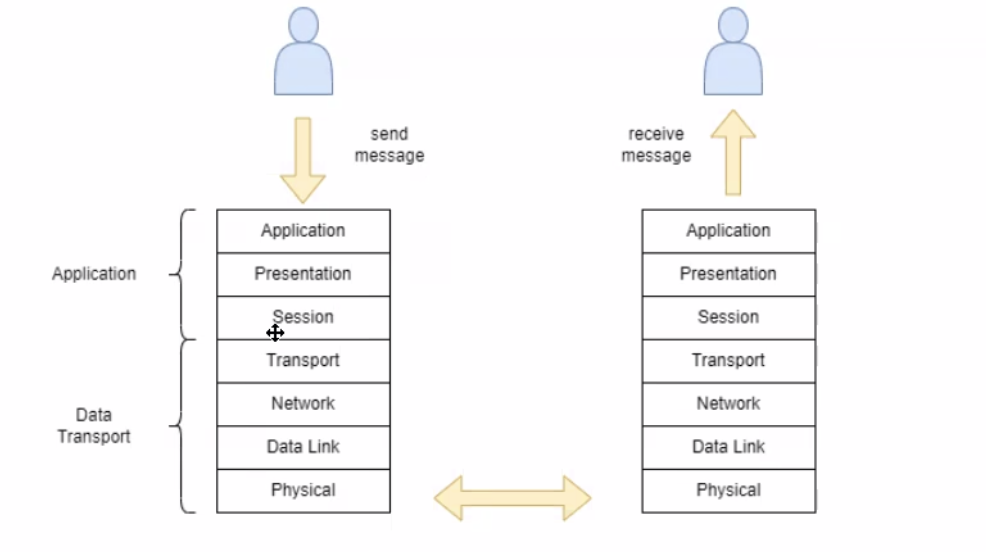

# Semana 3
# 7 de Marzo

## Conceptos 

**Repeaters** \
Un repeater es un dispositivo que recibe una señal y la retransmite a un nivel más alto o a un mayor poder, para que la señal pueda cubrir distancias más largas sin degradarse. Los repeaters se utilizan en redes de datos para extender el alcance de la transmisión de datos, asegurando que la señal llegue a su destino sin pérdida de calidad.

**Bridge**
Un bridge conecta varios dispositivos en una red. Por ejemplo, un switch puede aprender las direcciones MAC de los dispositivos conectados. Si se crea un bridge entre dos segmentos de red, las direcciones MAC se compartirán entre ambas LAN. Esto permite enviar información entre redes sin necesidad de un router, utilizando la capa 2.

**Modem** \
Un modem (modulador-demodulador) es un dispositivo que convierte las señales digitales de una computadora en señales analógicas que pueden ser transmitidas a través de líneas telefónicas o cables coaxiales, y viceversa. Esto permite la comunicación entre computadoras a través de redes de telecomunicaciones. 

**Firewall**
Existen múltiples tipos de firewalls:
1. Capa 3
    - Bloqueo de información a nivel de IP. 
2. Capa 4
    - Permite hacer bloqueos de UDP/TCP, puede permitir puertos de entrada o salida.
3. Capa 7 (Conocido como WAF = Web Application Firewall)
    - Este tipo de firewall se enfoca en la capa de aplicaciones de usuario. Puede detectar inyecciones de scripts o malware. Permite inspeccionar la parte de la comunicación que viaja en la capa de aplicación y no está encriptada (payloads, headers, query strings) en protocolos HTTP o HTTPS. La terminación SSL (SSL Termination) también es posible.

### Capa 7 
30 conexiones/segundo \
Bloqueo de usuarios \
El bloqueo no es bueno por que pasa esto:
- Content switch
- Thread
    - Memory
    - File Descriptors
    - CPU
- Socket
    - Memory
    - File Descriptors
    - CPU

### Bloqueo de IP
Debe pasar en router de capa 3, el firewall de capa 3 permite que sea más eficiente:
- Protege al servidor
- No hay que ensamblar el paquete de capa de transporte ni capa de aplicación.
Permite hacer un bloqueo más temprano. Todos los bloqueos de DDoS se hacen en capa 3, lo que reduce la carga en el servidor y mejora la eficiencia general de la red. Entre mayor el bloqueo es mejor pero es menos flexible. 

## Tipos de Redes
1. WAN (Wide Area Network)
    - Una red de área amplia que cubre una gran área geográfica, como un país o un continente. Se utiliza para conectar múltiples redes LAN y MAN.
2. MAN (Metropolitan Area Network)
    - Una red de área metropolitana que cubre una ciudad o una gran área urbana. Es más grande que una LAN pero más pequeña que una WAN.
3. LAN (Local Area Network)
    - Una red de área local que cubre un área pequeña, como una oficina, un edificio o un campus. Es utilizada para conectar dispositivos dentro de una misma ubicación.
4. PAN (Personal Area Network)
    - Una red de área personal que cubre un área muy pequeña, generalmente unos pocos metros. Se utiliza para conectar dispositivos personales como teléfonos móviles, tabletas y computadoras portátiles.

- Conectividad efectiva
- Confiabilidad
- Administración y soporte centralizado
- Flexibilidad de expansión

### Usos de las redes
- Compartir recursos -> Conectividad
- VPN/Peer-To-Peer:
    - Cliente - Servidor: Uno tiene muchos clientes contra un servidor o una granja de servidores. El servidor tiene muchos recursos y los clientes consumen de este. Es un sistema distribuido pero muy centralizado. 
    - Esquema de funcionamiento básico peer-to-peer: Se va a tener una red mesh altamente conectada (todos los nodos en la red que la conforman, son clientes y servidores)
        - Están distribuidos geográficamente
        - Si se cae un nodo la red sigue funcionando (mientras haya uno funcionando)
        - Se distribuyen archivos de seeds (servidores que comparten información de las máquinas que entran y salen de los sistemas peer-to-peer)
        - Cuando se comparte un archivo con el seed, las demás máquinas pueden descargar partes del archivo desde múltiples fuentes, esto comienza a consumir el ancho de banda de la seed con dicha información. Los clientes se comparten información a los demas clientes, esto es fucional para pedir información paralelo y se pasa la información mas rápido. 
- Almacenamiento -> Compartir
- Redundancia 
- Servicios Cliente-Servidor
- Medios de Comunicación
- Negocios Digitales

## Modelo OSI
- Modelo de referencia para hacer comparación 
- Capas:
    1. **Capa Física**: Se encarga de la transmisión de bits a través de un medio físico.
    2. **Capa de Enlace de Datos**: Proporciona la transferencia de datos entre dos nodos conectados directamente.
    3. **Capa de Red**: Se encarga del direccionamiento y enrutamiento de los paquetes de datos.
    4. **Capa de Transporte**: Proporciona transferencia de datos confiable y control de flujo.
    5. **Capa de Sesión**: Gestiona y controla las conexiones entre computadoras.
    6. **Capa de Presentación**: Traduce los datos entre el formato de la red y el formato que puede usar una aplicación.
    7. **Capa de Aplicación**: Proporciona servicios de red directamente a las aplicaciones del usuario.

- Comunicación entre sistemas es completa 
- Interoperabilidad 
- Arquitectura de red: conjunto de capas y protocolos -> Ayudan a tener interoperabilidad

### Aspectos importantes
- Detección de errores: Identificación de errores en la transmisión de datos.
- Corrección de errores: Uso de redundancia para corregir errores detectados.
- Enrutamiento: Determinación del camino que deben seguir los datos a través de la red.
- Direccionamiento / nombramiento de IPv4 e IPv6: Asignación de direcciones únicas a dispositivos en la red.
- Control de flujo: Gestión de la cantidad de datos que se envían para evitar la congestión.
- Redes escalables: Capacidad de la red para crecer y adaptarse a mayores demandas.
- Congestión de red: Situación en la que la demanda de tráfico excede la capacidad de la red.
- QoS (Quality of Service): Mecanismos para garantizar un rendimiento adecuado de la red.
- Seguridad: Protección de la información mediante confidencialidad, integridad y autenticación

## Modelo OSI (Flujo)

## Transporte de datos entre capas

## Protocolo de red
- Conjunto establecido de reglas que determinan como los datos son transmitidos entre dos dispositivos en una red. Los protocolos de red aseguran que los datos sean enviados, recibidos y procesados correctamente. Algunos ejemplos de protocolos de red incluyen TCP/IP, HTTP, FTP y SMTP.

## Tipo de protocolos
- Protocolos LAN
    - capa fisica y de enlace a datos
- Protocolos WAN
    - capa fisica, capa de enlace a datos y capa de red
- Protocolos de enrutamiento
    - capa de red
    - resposanbles de la determinación y conmutación del camino
- Protocolos enrutados
    - internet protocol

## Ejmplo de protocolos
7. Aplicación: HTTP, Telnet, DNS
5. Sesión: Netbios, SIP
3. Red: IP, RIP, BGP
1. Fisica: Ethernet, Wireless
6. Presentación: Quick Time, MPEG
4. Transporte: TCP, UDP

